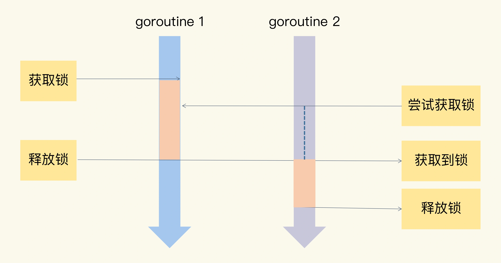
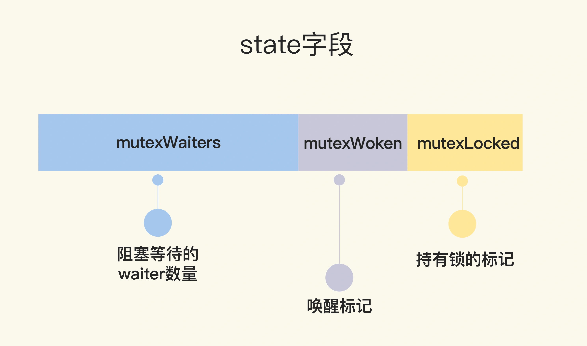
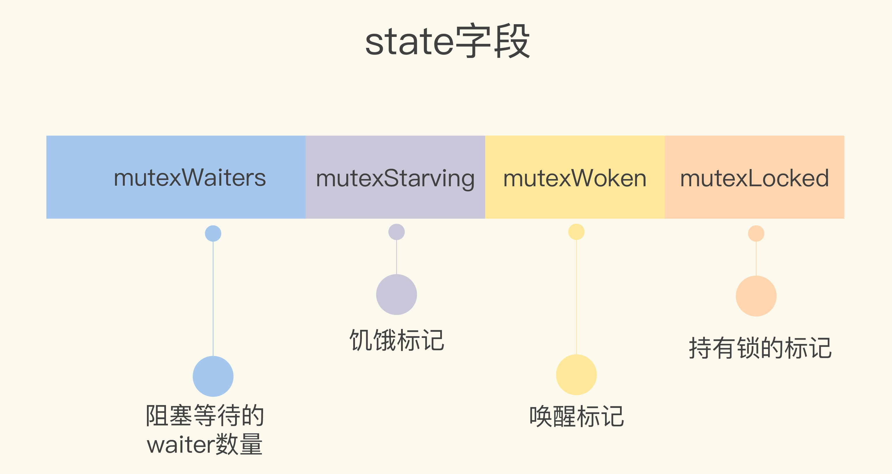

# 描述

Mutex是为了解决并发过程中的竞争问题而建立的一种并发控制机制，Mutex是一种互斥锁

## 临界区

程序中因并发访问而导致意想不到的结果的代码片段，就叫作临界区。

临界区的代码，在并发访问中，需要被保护起来，同一时间只能有一个进程/线程访问

临界区针对的是一些共享资源，而这些共享资源需要被串行访问



```golang
package main

import (
	"fmt"
	"sync"
)

func main() {
	count := 0
	var wg sync.WaitGroup
	wg.Add(10)
	for i := 0; i < 10; i++ {
		go func() {
			defer wg.Done()
			for j := 0; j < 100000; j++ {
				count++
			}
		}()
	}
	wg.Wait()
	fmt.Println(count)
}

// 411305
```

在上边的示例中，`count`就是共享资源，在没有被保护的情况下，10个线程对其进行操作，操作的结果明显不是我们预期的结果

**通过 `go race detector` 监控共享变量的同步访问**

执行脚本时，通过`-race`参数，可以一键启动 `go race detector`

```golang
➜  go-mod-test git:(main) ✗ go run -race main.go
==================
WARNING: DATA RACE
Read at 0x00c00013e008 by goroutine 8:
  main.main.func1()
      /Users/xiaosongliu/go/go-mod-test/main.go:16 +0x78

Previous write at 0x00c00013e008 by goroutine 7:
  main.main.func1()
      /Users/xiaosongliu/go/go-mod-test/main.go:16 +0x91

Goroutine 8 (running) created at:
  main.main()
      /Users/xiaosongliu/go/go-mod-test/main.go:13 +0xe4

Goroutine 7 (running) created at:
  main.main()
      /Users/xiaosongliu/go/go-mod-test/main.go:13 +0xe4
==================
==================
WARNING: DATA RACE
Read at 0x00c00013e008 by goroutine 9:
  main.main.func1()
      /Users/xiaosongliu/go/go-mod-test/main.go:16 +0x78

Previous write at 0x00c00013e008 by goroutine 7:
  main.main.func1()
      /Users/xiaosongliu/go/go-mod-test/main.go:16 +0x91

Goroutine 9 (running) created at:
  main.main()
      /Users/xiaosongliu/go/go-mod-test/main.go:13 +0xe4

Goroutine 7 (running) created at:
  main.main()
      /Users/xiaosongliu/go/go-mod-test/main.go:13 +0xe4
==================
322643
Found 2 data race(s)
exit status 66

```

# 基本使用方法

```golang
package main

import (
	"fmt"
	"sync"
)

func main() {
	count := 0
	var wg sync.WaitGroup
	var mu sync.Mutex
	wg.Add(10)
	for i := 0; i < 10; i++ {
		go func() {
			defer wg.Done()
			for j := 0; j < 100000; j++ {
				mu.Lock()
				count++
				mu.Unlock()
			}
		}()
	}
	wg.Wait()
	fmt.Println(count)
}

// 1000000
```

嵌入到其他struct中使用

```golang
package main

import (
	"fmt"
	"sync"
)

type Counter struct {
	mu sync.Mutex
	count uint64
}

func main() {
	counter := Counter{}
	var wg sync.WaitGroup
	wg.Add(10)
	for i := 0; i < 10; i++ {
		go func() {
			defer wg.Done()
			for j := 0; j < 100000; j++ {
				counter.mu.Lock()
				counter.count++
				counter.mu.Unlock()
			}
		}()
	}
	wg.Wait()
	fmt.Println(counter.count)
}

// 1000000
```

或是进行一下封装，对外不暴露加锁逻辑

```golang
package main

import (
	"fmt"
	"sync"
)

type Counter struct {
	mu    sync.Mutex
	count uint64
}

func (c *Counter) Incr() {
	c.mu.Lock()
	c.count++
	c.mu.Unlock()
}

func main() {
	counter := Counter{}
	var wg sync.WaitGroup
	wg.Add(10)
	for i := 0; i < 10; i++ {
		go func() {
			defer wg.Done()
			for j := 0; j < 100000; j++ {
				counter.Incr()
			}
		}()
	}
	wg.Wait()
	fmt.Println(counter.count)
}

// 1000000

```

锁的抢占和释放是非常简便的，只要调用 `Lock()` 和 `Unlock()`方法即可

# 实现原理

## 第一版

第一版的`sync.Mutex`,通过一个标识位`key`表示锁是否被持有，

```golang
type Mutex struct {
	key int32;
	sema int32;
}
```

- `key = 0`表示锁还没有被获取
- `key = 1`表示当前goroutine获取到了锁
- `key > 1`表示当前goroutine需要等待锁被释放

**sema:** 是一个信号量变量，用来控制等待goroutine的阻塞休眠和唤醒

**Lock方法实现:**

```golang
func (m *Mutex) Lock() {
	if xadd(&m.key, 1) == 1 {
		// changed from 0 to 1; we hold lock
		return;
	}
	semacquire(&m.sema);
}
```

- 首先是加锁，加锁成功后返回key值，如果`key = 1`，则说明获取到锁，直接返回执行`临界区`代码
- 如果锁被别的 goroutine 获取，则调用`semacquire`方法，使用信号量`sema`将自己休眠，等锁释放的时候，信号量会将它唤醒
  
**Unlock方法实现:**

```golang

func (m *Mutex) Unlock() {
	if xadd(&m.key, -1) == 0 {
		// changed from 1 to 0; no contention
		return;
	}
	semrelease(&m.sema);
}
```

- 首先是释放锁，释放成功后返回key值，如果`key = 0`，说明当前没有等待中的 goroutine，则直接退出即可
- 如果存在等待中的 goroutine ，则通过信号量唤醒 goroutine

加锁和释放锁有个非常重要的方法`xadd`，其实现逻辑如下：

```golang
func xadd(val *int32, delta int32) (new int32) {
	for {
		v := *val;
		if cas(val, v, v+delta) {
			return v+delta;
		}
	}
	panic("unreached")
}
```

其实现原理是：循环调用`cas`方法，对`key`进行加`delta`值操作，直到操作成功，需要说明的是cas方法是一个原子操作

cas指令说明：

`func cas(val *int32, old, new int32) bool`

将给定值`old`与一个内存地址中的值`val`进行比较，如果相等，则用新值`new`替换内存中的值，这个操作是一个原子操作，这个很重要，`sync.Mutex`实现的基础就是这个原子操作，要不然无法保证上锁的原子性，也就无法对`临界区`的代码进行保护

cas实现源码：

```
asm_386.s
TEXT sync·cas(SB), 7, $0
	MOVL	4(SP), BX
	MOVL	8(SP), AX
	MOVL	12(SP), CX
	LOCK
	CMPXCHGL	CX, 0(BX)
	JZ ok
	MOVL	$0, 16(SP)
	RET
ok:
	MOVL	$1, 16(SP)
	RET
```

```
asm_amd64.s
TEXT sync·cas(SB), 7, $0
	MOVQ	8(SP), BX
	MOVL	16(SP), AX
	MOVL	20(SP), CX
	LOCK
	CMPXCHGL	CX, 0(BX)
	JZ ok
	MOVL	$0, 24(SP)
	RET
ok:
	MOVL	$1, 24(SP)
	RET
```


到此，第一版的`sync.Mutex`实现原理就说完了，以下是需要注意的点：

- `sync.Mutex` 与 `goroutine` 没有关联关系，所以 `sync.Mutex` 并不知道谁在加锁，谁在释放锁，也就是说任何一个`goroutine`都可以加锁，也都可以释放锁，最可怕的是还可以只加锁或只释放锁，所以使用时一定要注意，加锁和释放锁要成对出现，要不然`临界区`代码的原子性将不能被保证

第一版代码在`commit：d90e7cbac65c5792ce312ee82fbe03a5dfc98c6f`版本上

## 第二版（给新人多一些机会）

第一版到第二版的升级在 `dd2074c82acda9b50896bf29569ba290a0d13b03` 这次提交中完成的

**结构体**

```golang
type Mutex struct {
	state int32
	sema  uint32
}
```
- sema还是表示信号量。与第一版相同，唯一区别在于在第一版的演进过程中信号量的数据类型由`int32`换成了`uint32`,细思也正常，因为信号量本身就应该是一个非负数，这个转变同时也增大了信号量的上限（虽然不见得用得着）
- 第一版的key变成了state，而且该标识位表达的含义更复杂了
    - 第一位：表示锁是否被持有，用locked表示
    - 第二位：表示是否有唤醒的waiter，用woken表示
    - 剩余的：表示等待此锁的waiters数量，用waiters表示



**加锁逻辑**

加锁逻辑也变得更加复杂

```golang
func (m *Mutex) Lock() {
	// Fast path: grab unlocked mutex.
	// 先尝试加锁，万一能加上呐
	if atomic.CompareAndSwapInt32(&m.state, 0, mutexLocked) {
		return
	}

	awoke := false
	for {
		old := m.state
		new := old | mutexLocked    // 置 locked 加锁
		if old&mutexLocked != 0 {   // 如果锁已经别加锁，则 waiters数量 加一
			new = old + 1<<mutexWaiterShift
		}
		if awoke {
			// The goroutine has been woken from sleep,
			// so we need to reset the flag in either case.
			// 如果该协程是被唤醒的waiter，则需要把 woken位置空
			new &^= mutexWoken
		}
		if atomic.CompareAndSwapInt32(&m.state, old, new) {     // 原子操作尝试设置state值
			if old&mutexLocked == 0 {   // 如果抢到锁，则退出循环，去执行边界代码
				break
			}
			runtime.Semacquire(&m.sema) // 如果没有抢到锁，则进入睡眠
			awoke = true    // 被唤醒后，开始进入循环抢锁
		}
	}
}
```

- 该Lock代码有个问题就是：waiter有可能需要等待很长时间都得不到锁，这个时候最好配合超时时间使用，超过指定时间则直接退出加锁逻辑

**解锁逻辑**

```golang
func (m *Mutex) Unlock() {
	// Fast path: drop lock bit.
	// 清除锁状态
	new := atomic.AddInt32(&m.state, -mutexLocked)
	if (new+mutexLocked)&mutexLocked == 0 { // 如果锁没有被持有，说明正在对没有被持有的锁进行解锁，panic
		panic("sync: unlock of unlocked mutex")
	}

	old := new
	for {
		// If there are no waiters or a goroutine has already
		// been woken or grabbed the lock, no need to wake anyone.
		// 如果waiters为空，或是锁已经被持有，或是已经有woken，则不需要进行唤醒操作，直接退出即可
		if old>>mutexWaiterShift == 0 || old&(mutexLocked|mutexWoken) != 0 {
			return
		}
		// Grab the right to wake someone.
		// waiters数量减一并置woken，如果成功则唤醒waiters，如果不成功，则继续尝试操作
		new = (old - 1<<mutexWaiterShift) | mutexWoken
		if atomic.CompareAndSwapInt32(&m.state, old, new) {
			runtime.Semrelease(&m.sema)
			return
		}
		old = m.state
	}
}
```

**总结**

第二版与第一版的区别在于：
- 第一版新的goroutine进来后，并不能直接参与抢占锁，而是直接进入排队中，这样对新的goroutine不是很友好，而且新的goroutine很可能正在占用CPU时间分片，这对程序的处理也是不友好的
- 第二版改变了策略，新的goroutine进来后，可以直接参与锁的抢占，这样新的goroutine抢占到锁的机会就会大大增加，但是也存在一个问题就是，随着新的goroutine的增加，等待队列的增长，在排队中的goroutine会越来越难以抢占到锁，从而造成`饥饿状态`

## 第三版（多一些机会）

第三版要解决的是频繁进入睡眠和唤醒带来的开销。因为对于一些简单的`边界代码`执行花费的时间是非常短的，锁很快就能释放，针对新的goroutine或被唤醒的goroutine，通过`自旋`的方式是一个非常好的优化，`自旋`是通过runtime实现的

**加锁**

```golang 
func (m *Mutex) Lock() {
	// Fast path: grab unlocked mutex.
	if atomic.CompareAndSwapInt32(&m.state, 0, mutexLocked) {
		if raceenabled {
			raceAcquire(unsafe.Pointer(m))
		}
		return
	}

	awoke := false
	iter := 0
	for {
		old := m.state
		new := old | mutexLocked
		if old&mutexLocked != 0 {
			if runtime_canSpin(iter) {
				// Active spinning makes sense.
				// Try to set mutexWoken flag to inform Unlock
				// to not wake other blocked goroutines.
				if !awoke && old&mutexWoken == 0 && old>>mutexWaiterShift != 0 &&
					atomic.CompareAndSwapInt32(&m.state, old, old|mutexWoken) {
					awoke = true
				}
				runtime_doSpin()
				iter++
				continue
			}
			new = old + 1<<mutexWaiterShift
		}
		if awoke {
			// The goroutine has been woken from sleep,
			// so we need to reset the flag in either case.
			if new&mutexWoken == 0 {
				panic("sync: inconsistent mutex state")
			}
			new &^= mutexWoken
		}
		if atomic.CompareAndSwapInt32(&m.state, old, new) {
			if old&mutexLocked == 0 {
				break
			}
			runtime_Semacquire(&m.sema)
			awoke = true
			iter = 0
		}
	}

	if raceenabled {
		raceAcquire(unsafe.Pointer(m))
	}
}
```

加锁逻辑中添加了如下实现自旋的代码块 

```golang
if runtime_canSpin(iter) {
	// 如果当前没有被唤醒的goroutine，而且存在排队中的goroutine，尝试设置Woken标志位，以防止Unlock操作唤醒排队中的goroutine
	// 这样可以提高该goroutine抢占到锁的概率
	if !awoke && old&mutexWoken == 0 && old>>mutexWaiterShift != 0 &&
		atomic.CompareAndSwapInt32(&m.state, old, old|mutexWoken) {
		awoke = true
	}
	runtime_doSpin()
	iter++
	continue
}
```

程序通过`iter`控制自旋的次数，在goroutine被唤醒后，`iter`会被重置为0

## 第四版（解决饥饿）

在第二版的优化中，增加了新goroutine的机会，但是相对的，减少了排队中goroutine的机会，如何能做到尽量公平，就是这版要解决的问题



- 在第四版中，添加了饥饿标记

# 常见的错误场景

- Lock和Unlock不是成对出现
- copy已使用的mutex
- 重入
- 死锁

## Lock和Unlock不是成对出现

- 代码中有太多的if-else分支，可能在某个分支中漏写了Unlock
- 在重构的时候把Unlock删除了
- Unlock误写成了Lock

针对这种情况，最好是`边界代码`单独封装在一个方法中，这样加锁的逻辑也会比较简单，减少出错的可能性

## copy已使用的mutex

这里需要先交代一个知识点：Package sync 的同步原语在使用后是不能复制的。因为Mutex是一个有状态的对象，它的state字段记录了这个锁的状态，如果进行了复制，有可能新的变量初始化就是带着状态的

```golang
package main

import (
	"fmt"
	"sync"
)

type Counter struct {
	sync.Mutex
	count int
}

func (c *Counter) Foo() {
	defer c.Unlock()
	c.Lock()
	c.Inc()
	fmt.Println(c.count)
}

func (c *Counter) Inc()  {
	defer c.Unlock()
	c.Lock()
	c.count++
}

func main() {
	counter := Counter{}
	counter.Foo()
}

// fatal error: all goroutines are asleep - deadlock!
```

